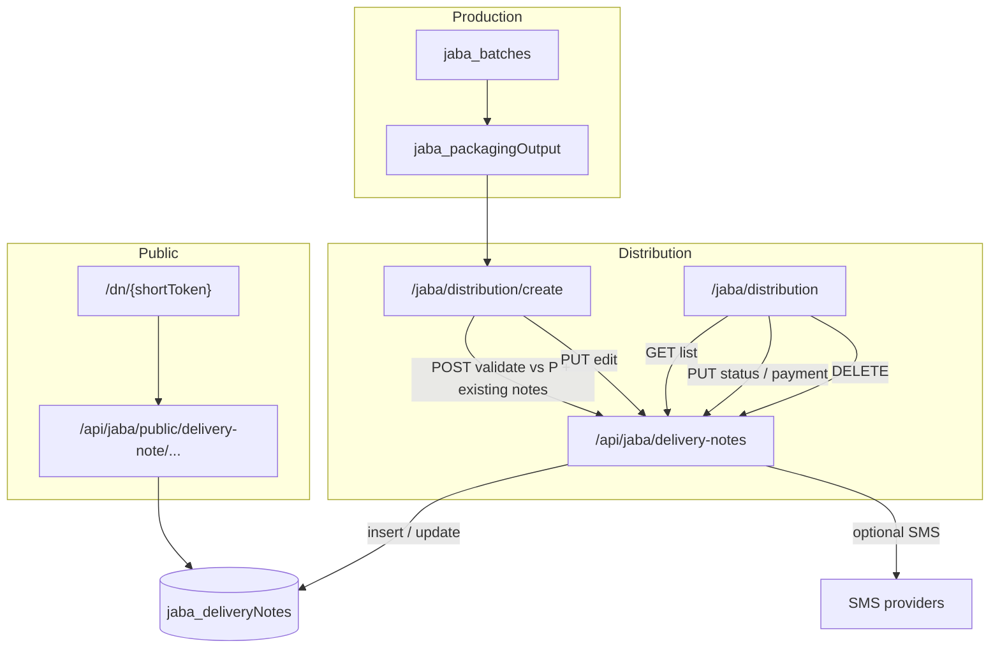

# Jaba distribution — how it works today

This document describes **how distribution is implemented** under `/jaba`: UI entry points, APIs, data rules, notifications, and how delivery notes connect to packaging, inventory views, and reporting.

For broader Jaba context (auth, RBAC, all routes), see [`README.md`](./README.md).

---

## 1. What “distribution” means in this app

Distribution is modeled as **delivery notes** (`jaba_deliveryNotes` in MongoDB `infusion_jaba`). Each note:

- Has a human-readable **`noteId`** (sequential **`DN-001`** … **`DN-999`** from the next-id helper; older random IDs may exist in legacy data).
- Targets a **distributor** (`distributorId`, `distributorName`).
- Contains one or more **line items**: finished product, **batch number**, optional **flavour line**, **bottle size** (`250ml` / `500ml` / `1L` / `2L`), **package number**, **quantity**, pricing.
- Tracks **delivery status** (`Pending` → `In Transit` → `Delivered`) and **payment status** (`Unpaid` / `Partial` / `Paid`).
- Stores two **secret link tokens** used only server-side for public viewing: `viewToken` (hex) and `publicShortToken` (short slug). They are **stripped** from authenticated list/detail JSON so they are not leaked to the browser in normal admin flows.

There is **no separate `/jaba/distribution/dispatch` page**; dispatch is expressed as creating/updating delivery notes and their statuses.

---

## 2. Operator journey (end-to-end)

### 2.1 Prerequisites on the production side

1. **Packaging** must exist in `jaba_packagingOutput` with `containers[]` (per size quantities) for the batch (and flavour line when applicable).
2. **`jaba_batches`** supplies batch metadata (batch number, dates, flavour, product category) used to **order FIFO** and resolve packaging rows. Create is **global**: staff pick **flavour + bottle size + quantity + price** only; **no `?batch=`** scoping (legacy query param is stripped on `/jaba/distribution/create`).

### 2.2 Partners

- **Distributors** are maintained under **`/jaba/distributors`** → `GET/POST/PATCH/DELETE /api/jaba/distributors`.
- **Distributor requests** (`/jaba/distributor-requests`) are an **onboarding queue** for new partners (`/api/jaba/distributor-requests`); they are **not** automatically converted into delivery notes.

### 2.3 Create or edit a delivery note

| Step | Where | What happens |
|------|--------|----------------|
| Open create flow | **`/jaba/distribution/create`** | Permission: `distribution.create` (add). Global product list from all packaged stock; **`?batch=` is ignored** (removed from the URL). |
| Suggested next `noteId` | `GET /api/jaba/delivery-notes/next-id` | Scans existing notes, finds max `DN-###` in range 1–999, returns next padded id. **This route does not enforce Jaba session** in code—treat as implementation detail; protect at edge if needed. |
| Load stock context | Same page | Fetches **`/api/jaba/batches`**, **`/api/jaba/packaging-output`**, **`/api/jaba/delivery-notes`** to compute **what is still available** to allocate (packaged minus quantities already on **any** delivery note, all statuses). |
| Choose distributor | UI | Uses distributor list from **`/api/jaba/distributors`**. |
| Submit new note | `POST /api/jaba/delivery-notes` | Permission: `distribution.create` + `add`. Body sends staff lines (flavour / size / qty / price). Server runs **FIFO allocation + stock validation in a Mongo transaction** (see §3). |
| Edit existing note | Same page with edit query | `PUT /api/jaba/delivery-notes` with full payload + line items (see §4). |

After save, the app typically returns operators to **`/jaba/distribution`** (list).

### 2.4 Manage notes in the list

| Action | Where | API |
|--------|--------|-----|
| List / filter / print | **`/jaba/distribution`** | `GET /api/jaba/delivery-notes` (optional `distributorId`, `status` query params). Permission: `distribution.main` view. |
| Change **delivery status** | List UI dialogs | `PUT /api/jaba/delivery-notes` with `{ id, status }`. |
| Mark **paid** | List UI | `PUT` with `{ id, paymentStatus: 'Paid' }`. |
| **Delete** | List UI | `DELETE /api/jaba/delivery-notes?id=...`. UI asks for a **delete OTP** flow first; see §4 for server behavior. |

### 2.5 Public delivery note link

- On **create**, the API generates `viewToken` and `publicShortToken`.
- **Staff / automation SMS** may fire via `sendJabaSmsForEvent('distributionCreated', …)` (`lib/jaba-sms.ts`).
- If the distributor document has a **phone**, a **client SMS** can be sent with a short URL: **`{publicBase}/dn/{publicShortToken}`** (base from `getJabaPublicBaseUrl()`).
- The public page **`/dn/[slug]`** loads `DeliveryNotePublicClient`, which calls **`GET /api/jaba/public/delivery-note/{token}`** (no Jaba login). The API accepts **either** token field and returns a **sanitized** subset (no secrets).

### 2.6 When status becomes **Delivered**

- `PUT` with `status: 'Delivered'` triggers **`sendJabaSmsForEvent('distributionDelivered', …)`** when the note **transitions** from a non-delivered state to **Delivered** (implemented in the delivery-notes `PUT` handler).

---

## 3. Stock validation & FIFO allocation (authoritative rules on create / full item edit)

`POST /api/jaba/delivery-notes` and **`PUT` when `items` are sent** run inside a **MongoDB transaction** using `lib/jaba-delivery-note-fifo-allocation.ts`:

1. Load **all** `jaba_packagingOutput`, **all** `jaba_batches`, and **all** existing `jaba_deliveryNotes` (for **`PUT`**, the current note’s id is **excluded** from consumption math, then lines are **re-derived** from scratch).
2. The client sends **staff lines only**: flavour (or `flavourLineId`), bottle size, quantity, price per unit (plus display fields). **Batch number and package number from the client are not used** for allocation.
3. The server builds **per–packaging-output × size** slots, subtracts already-allocated quantities (including legacy lines without `packagingOutputId` via FIFO-style attribution within each batch + flavour + size bucket), and sorts slots **oldest batch first**, then oldest packaging session within the batch.
4. For each staff line, it **walks slots in order** and fills requested quantity until satisfied or stock runs out. If quantity exceeds total remaining for that flavour + size, the transaction aborts with **`400`**.
5. Persisted **`items[]`** hold the **split lines** (each with real `batchNumber`, `packageNumber`, `packagingOutputId`, `batchId`, quantities, `pricePerUnit`, `totalCost`). **`totalCost`** on the note is **recomputed server-side** (rounded KES). **`fifoAllocationTrace`** records internal audit slices per staff line.
6. Insert / update with default **`status: 'Pending'`** on create, **`paymentStatus: 'Unpaid'`** on create, timestamps, optional vehicle/driver fields.

**Important:** “Already distributed” still counts **all** notes (every status) for availability, so overlapping Pending notes still consume packaged stock. That is separate from **dashboard** “finished goods” stock math when it filters by **Delivered** (§5).

---

## 4. Updates, edits, deletes (API behavior)

All mutations go through **`/api/jaba/delivery-notes`** unless noted.

### 4.1 `PUT` (edit, status, payment)

- Permission gate: **`requireJabaAction('distribution.main', 'edit')`**.
- Immediately after, the handler calls **`requireDeleteOtp(request, 'delete_delivery_note', id)`** (`lib/jaba-delete-otp-guard.ts`):
  - Only **`super_admin`** may proceed.
  - Request must include header **`x-delete-otp`** with a valid OTP from **`/api/jaba/delete-otp`** for that target id.

So **every** `PUT` path (including status-only or payment-only) is gated the same way in code. The list and create pages **often call `PUT` without that header**; if updates fail with OTP / super-admin errors, that matches the current server implementation.

When `items` are present, the handler applies the **same FIFO derivation as `POST`**, excluding the current note from stock math then **replacing** `items` with newly derived slices (no reliance on prior batch/package lines from the client). Missing `publicShortToken` on old documents can be **backfilled** on update.

### 4.2 `DELETE`

- Permission: **`requireJabaAction('distribution.main', 'delete')`**.
- The handler **does not** verify `x-delete-otp` today, even though the UI collects an OTP before calling delete.

---

## 5. How delivery notes affect other surfaces

| Surface | Behavior |
|---------|----------|
| **`GET /api/jaba/finished-goods`** | For each packaged batch, **distributed** counts sum line items from **all** delivery notes matching that `batchNumber` (no filter by delivery status). **Remaining** = packaged − distributed. |
| **`GET /api/jaba/stock-movements`** | Each line item on **each** delivery note becomes an **`OUT`** movement (`source: 'distribution'`), again **not** filtered by note status. |
| **`GET /api/jaba/dashboard`** | **Finished goods KPIs** subtract quantities only from notes with **`status === 'Delivered'`**. **Counts**: `pendingDistributions` = notes `Pending`; `completedDistributions` = notes `Delivered`. (`In Transit` is not counted in those two buckets.) |
| **`GET /api/jaba/distribution-reports`** | Analytics over `jaba_deliveryNotes` + `jaba_distributors` (totals, rates, trends). |
| **`/jaba/reports/distribution`** | UI for distribution reports; uses **`/api/jaba/distribution-reports`**. |

So: **allocation** (cannot ship more than packaged minus committed on notes) is **stricter** and status-agnostic, while **dashboard stock** only drops on **Delivered**. Operators should be aware of that difference when reconciling screens.

---

## 6. Permissions (RBAC summary)

| Permission key | Typical use |
|----------------|-------------|
| `distribution.main` | `/jaba/distribution` — list, view, edit/delete via API as enforced per verb. |
| `distribution.create` | `/jaba/distribution/create` — **POST** new delivery note (`add`). |
| `distribution.dispatch` | Declared in permission maps for **`/jaba/distribution/dispatch`** — **no page implemented**; reserved / future. |
| `distribution.distributors` / `distribution.addDistributor` | Partner CRUD (separate from notes). |
| `reports.distribution` | `/jaba/reports/distribution`. |

Exact checks use `lib/jaba-permissions.ts` and `requireJabaAction` in `lib/api-jaba-permissions.ts`.

---

## 7. Related MongoDB collections

| Collection | Role in distribution |
|------------|----------------------|
| `jaba_deliveryNotes` | Source of truth for notes, items, status, payment, tokens. |
| `jaba_packagingOutput` | Ground truth for **how many** bottles exist per batch / flavour / size. |
| `jaba_batches` | Batch numbers, statuses, flavour lines for matching. |
| `jaba_distributors` | Distributor master data; **phone** used for client SMS. |
| `jaba_distributorHistory` | Read by **`/api/jaba/distributor-history`** for transactional history views/exports; **not** written in the delivery-notes route (may be populated by other jobs or scripts). |

---

## 8. Key source files (for developers)

| Area | Path |
|------|------|
| List / print / status / payment / delete UI | `app/jaba/distribution/page.tsx` |
| Create / edit form | `app/jaba/distribution/create/page.tsx` |
| Delivery notes API | `app/api/jaba/delivery-notes/route.ts` |
| FIFO allocation + availability helpers | `lib/jaba-delivery-note-fifo-allocation.ts` |
| Next `DN-###` id | `app/api/jaba/delivery-notes/next-id/route.ts` |
| Public JSON by token | `app/api/jaba/public/delivery-note/[token]/route.ts` |
| Short public URL page | `app/dn/[slug]/page.tsx` + `app/delivery-note/[token]/delivery-note-public-client.tsx` |
| SMS templates / toggles | `lib/jaba-sms.ts` |
| Public base URL helper | `lib/jaba-app-url.ts` |
| Unique short token generator | `lib/jaba-delivery-note-public-token.ts` |
| Finished stock view API | `app/api/jaba/finished-goods/route.ts` |
| Movement ledger API | `app/api/jaba/stock-movements/route.ts` |
| Distribution analytics API | `app/api/jaba/distribution-reports/route.ts` |
| Reports UI | `app/jaba/reports/distribution/page.tsx` |

---

## 9. Flow diagram (high level)

---

*This file reflects the codebase as documented here; if APIs change (for example OTP scope on `PUT`/`DELETE`), update this README alongside the route handlers.*
